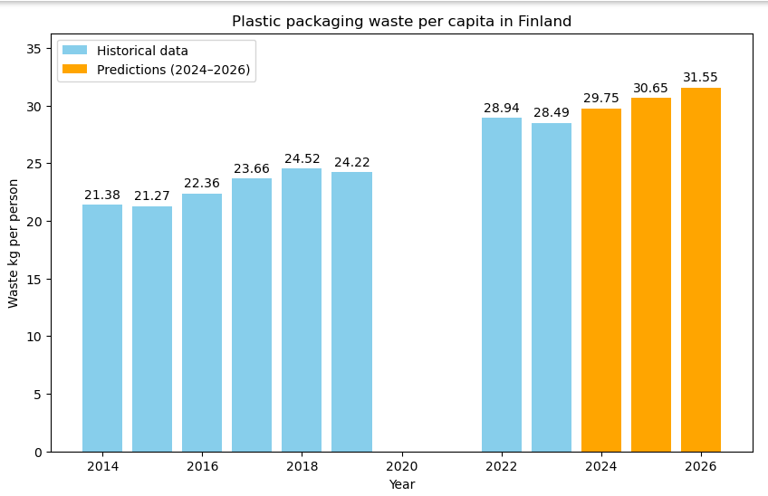

# Finland Plastic Packaging Waste Analysis & Prediction (2014-2026)

This project analyzes the trend of plastic packaging waste generation per person in Finland and predicts future waste levels for the years 2024–2026 using Linear Regression.

Data Cleaning:
* Renames unclear dataset columns to understandable English.
* Specifically excludes the years 2020 and 2021 (COVID-19 pandemic).
  * The reason: The pandemic caused an abnormal spike in plastic packaging waste (due to increased takeout, online shopping, etc.) which distorts the long-term trend analysis.

Visualization:
* Plots the historical waste data per person using a bar chart.

Prediction:
 * Uses a Linear Regression model (sklearn) to predict waste generation for 2024, 2025, and 2026.

## Visualization & Key Findings

### Key Findings
* **2023 Actual Level:** 28.49 kg per person
* **2026 Predicted Level:** 31.55 kg per person
* **Forecasted Growth (2023–2026):** Plastic packaging waste per capita in Finland is predicted to grow by **+10.74%** (+3.06 kg per person) by 2026 if historical trends continue.
* **Methodology Note:** The model excludes the COVID-19 pandemic years (2020–2021) to prevent short-term e-commerce and takeaway consumption anomalies from skewing long-term linear trends.

## Data Source & Scope
* **Source:** Eurostat (`env_waspac` - Packaging waste by waste management operations)
* **Scope:** Total plastic packaging waste generated per capita (kg/person) in Finland.
* **Sectors Included:** Economy-wide plastic packaging waste, combining:
  * **Household Waste:** Everyday consumer packaging (grocery packaging, food containers, beverage bottles).
  * **Commercial & Industrial Sectors:** Packaging waste generated by retail, logistics, manufacturing, and services (e.g., commercial shrink wrap, industrial plastic strapping).

> *Note: For full methodology on how Eurostat classifies economy-wide packaging waste, see the official [Eurostat env_waspac Metadata](https://ec.europa.eu/eurostat/cache/metadata/en/env_waspac_esms.htm).*
